序号：  

编码：  

第十六届“挑战杯”湖南省大学生课外学术科技作品竞赛

项目计划书

作品名称：智析肌电--FEP·MV-BRNN·LLMS智能系统

学校全称： 湘潭大学

申报者姓名：  MV-Fiber Guard

（集体名称）

□ 自然科学类学术论文

□ 哲学社会科学类社会调查报告和学术论文

□ 科技发明制作A类

  - 科技发明制作B类

# 

# 目录

[1. 项目纵览 5](#_Toc199940110)

> [1.1 项目背景 5](#_Toc30287)
> 
> [1.2 全貌剖析 5](#_Toc9186)
> 
> [1.3 研究现状 9](#_Toc8791)

[2. 解决方案 12](#_Toc20506)

> [2.1 方案提出 12](#_Toc10670)
> 
> [2.2.1 设计流程 13](#_Toc30198)
> 
> [2.2.2 技术特点 13](#_Toc21087)
> 
> [2.3 柔性肌电图贴片的结构设计 16](#_Toc18179)
> 
> [2.3.1 网状电极结构 16](#_Toc17964)
> 
> [2.3.2 原位凝胶化水凝胶界面 16](#_Toc359)
> 
> [2.3.3 封装设计 17](#_Toc30148)
> 
> [2.4 最终设计方案 17](#_Toc30196)
> 
> [2.5 系列实验 17](#_Toc12090)
> 
> [2.5.1 材料表征实验 17](#_Toc8407)
> 
> [2.5.2 生物相容性实验 20](#_Toc21221)
> 
> [2.5.3 EMG监测和疲劳状态检测 22](#_Toc19066)
> 
> [2.6 部署本地大模型 23](#_Toc199940129)
> 
> [2.6.1 模型训练与优化 23](#_Toc199940130)
> 
> [2.6.2 知识库构建与管理 24](#_Toc199940131)
> 
> [2.6.3 计算资源与开发工具 25](#_Toc199940132)
> 
> [2.7 仿真实验平台 25](#_Toc199940133)
> 
> [2.7.1 大语言模型（LLM）驱动的智能体 26](#_Toc199940134)
> 
> [2.7.2 真实社会环境建模 26](#_Toc199940135)
> 
> [2.7.3 大规模并行计算引擎 26](#_Toc199940136)
> 
> [2.7.4 平台优势及潜在应用场景 26](#_Toc199940137)
> 
> [2.8 创新性与先进性 27](#_Toc24740)

[3. 实验推进计划 30](#_Toc32531)

> [3.1 实物展示 30](#_Toc12741)
> 
> [3.2 肌电贴片的实际使用过程 31](#_Toc23110)
> 
> [3.3 贴片保护事宜 32](#_Toc21768)

[4. 市场前景与效益分析 32](#_Toc26160)

> [4.1 市场前景分析 32](#_Toc3625)
> 
> [4.2 经济与社会效益分析 35](#_Toc30755)
> 
> [4.3 展望 37](#_Toc199940150)

[参考文献 38](#_Toc25264)

[附录 43](#_Toc199940152)

摘要

本研究提出一种**柔性表皮贴片**，通过**低模量网状电极**与**原位凝胶水凝胶界面**的协同设计，实现了对动态皮肤表面的稳固粘附。基于**多视图分支循环神经网络**的算法进一步分类，严格的**生物相容性**测试验证了其长期使用的安全性。与商用电极相比，贴片在真实场景中的信噪比提升**三倍**。获得**中国工程院院士欧阳晓平院士**的指导；并获得湘潭大学计算机学院副院长**邹娟**教授和数学与计算科学学院副院长**王文强**教授的推荐；产出论文已投**《Infomat》（IF为22.7）**；项目团队负责人正与**重庆小米金融总裁曹子玮**洽谈投资事宜；搭建本地大模型问答平台，应用QLoRA技术对大语言模型进行有监督微调SFT、直接偏好优化DPO，并通过自动合并adapter层与base模型权重，进一步提高生成效果。产出论文已投《Swarm
and Evolutionary
Computation》（IF为8.2）；已与湖南智慧龙岗科技有限公司签订**50w**合同；同时调参所用算法已申请**发明专利**《一种基于双种群进化算法的多目标约束优化方法》并与**深圳朴浪有限创新科技有限公司**签订合同；同时，依据《Human–AI
adaptive dynamics drives the emergence of information
cocoons》（IF为18.8）构建动态虚拟社会环境，搭建ABM+LLMs双核驱动的仿真实验平台，为产品市场策略与疾病预防政策提供量化依据。产出论文已投《Leisure
Study》（IF为2.3）；同时平台受到**湖南省政协副主席潘碧灵**的深切关注。此外，基于此项目我们还申请了发明专利《一种涉及机器学习模型训练装置》、实用新型发明专利《一种大数据科学管理的智能门卫监控装置》、软著《大数据信息交互采集管理系统》、《自适应机器学习平台》等。同时项目“获新华网、湖南日报”等多家官媒报道，卫视新闻联播采访。

关键词：原位凝胶水凝胶柔性表皮贴片、多视图分支循环神经网络、可穿戴生物传感、智能健康监测、大模型

1. 项目纵览

1.1 项目背景

**久坐引发的腰椎问题亟需精确EMG检测工具来应对现代生活挑战**。久坐是现代生活中腰椎问题的主要诱因\[1-5\]，如椎间盘突出、椎管狭窄和脊柱退行性疾病\[6-9\]，对身心健康构成严重威胁。

据《柳叶刀风湿病学》报告，全球超6.19亿人患有慢性背痛，预计2050年将增至8.43亿\[10\]；美国15.4%的劳动人口每年因慢性背痛损失10.5个工作日\[11-14\]；中国超2亿人患腰椎间盘疾病，其中60%为20-40岁人群\[15-18\]，凸显问题普遍性与严重性。当前缓解腰椎疾病的方法多依赖经验指南，如定时站立或调整坐姿，但未能充分考虑个体生理差异。

肌电图(EMG)作为早期诊断工具具潜力\[21\]，可监测肌肉活动\[19,20\]，却因久坐时肌肉活动低、信号微弱而受限，难以获取足够数据。因此，设计能精确记录EMG信号的检测工具成为当务之急。

1.2 全貌剖析

根据浙江大学体育系的实际需求,
基于国家自然科学基金(62204210、62471465)、**中国科学院战略重点研究计划**(XDBO520301)等，本项目设计并开发一种柔性肌电图传感器（FES/FEP），其核心创新在于采用低模量网状电极和原位凝胶水凝胶界面，能够在久坐状态下稳定采集微弱的肌电信号，为腰椎疾病管理从被动治疗向主动预防的转变提供了积极的启示。

基柔性肌电贴片(FEP)通过创新设计显著提升微弱EMG信号采集的稳定性和应用价值。如图1-1，在长期坐姿等动态环境下，传统EMG电极因信号微弱采集不稳定及导电水凝胶粘附力不足而受限，本项目提出的柔性肌电贴片通过网状电极和原位凝胶水凝胶界面组成有效解决这些问题，展现出临床诊断与腰椎疾病康复的潜力。产品网状电极具有**1.8MPa**低杨氏模量，确保柔韧性（柔韧性达**1.85 MPa**、拉伸率超过**40%**）和皮肤贴合性；由明胶和毗啶烷酮磺酸钠(PCA-Na)制成的原位凝胶水凝胶直接在皮肤上凝胶，提供**0.3N/cm**强粘附力和**8.3mC/cm²**电荷存储容量，使10Hz频率下界面阻抗降至**40kΩ/cm²**，信噪比达**23.28dB**，无需额外皮肤准备或粘合剂。作为演示，FEP成功监测长时间坐姿中的肌肉疲劳，其高信噪比和稳定性为腰椎疾病早期发现和康复提供可靠支持，展现出良好的应用前景。

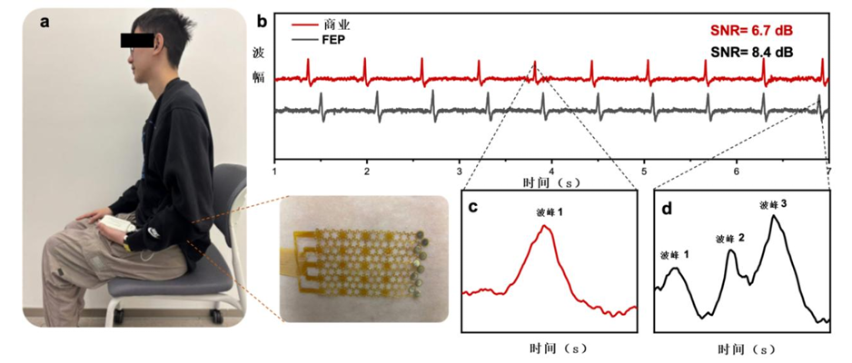

图1-1: (a)说明在会议期间放置FES的示意图。(b)-（d)使用商用电极和FEP

本项目采用**多视图分支循环神经网络**等深度学习算法，如图1-2，对采集到的肌电信号（sEMG）进行实时分析、去噪、特征提取与分类。结合早期与晚期融合策略，显著提升了对微弱EMG信号的处理精度。在长期坐姿引发的肌肉疲劳监测中，实验结果显示，该方法在疲劳与非疲劳状态分类中分别取得了**95.00%和****81.22%**的准确率，优于单一视图方法，提升了监测的实时性与可靠性。

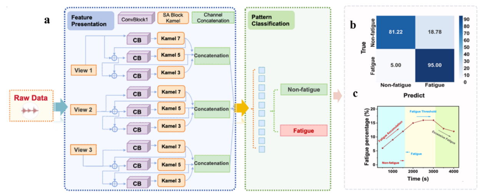

图1-2：(a)模型架构、(b)验证集模型的混淆矩阵 (c)久坐疲劳分图

项目搭建了本地大模型问答平台，基于校企合作项目“无创血糖大模型问答系统”二次开发，原项目已签署“合作前期协议保密书”与“专利实施许可合同”，如图1-3所示，获企业**50万**经费，模型性能超验收标准16%。

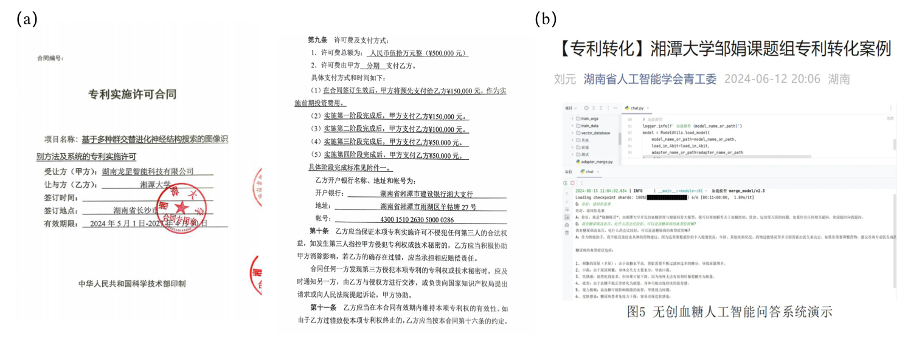

图1-3：基于无创血糖医疗大模型二次开发 (a)专利实施合同，许可证总额50万 (b)专利转化案例证明

可使用DeepSeek、Qwen等系列模型作为base模型，应用 **QLoRA** 技术对大语言模型进行**有监督微调**
SFT、**直接偏好优化** DPO，并通过自动合并adapter 层与 base
模型权重，进一步提高生成效果，如图1-4所示。同时，采用**RAG检索机制**拓展模型的知识边界，增强了泛化能力和内容可信度，从而为腰椎疾病的早期诊断和预防提供可靠的支持。

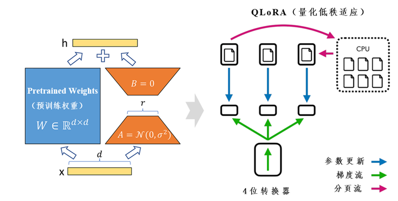

图1-4：QLoRA技术优化模型训练原理

项目同时，创新性地构建"**智能体建模（ABM）+
LLMs**"双核驱动的**大规模社会仿真实验平台**，研究产品在人群中的推广路径及久坐行为诱发的腰椎疾病风险传播规律，系统架构，如图1-5。该平台通过结合智能体（Agent）、真实社会环境建模和高性能计算引擎，能模拟超过**10,000
+**个智能体及其**500万+次**互动，为产品市场策略与疾病预防政策提供量化依据。

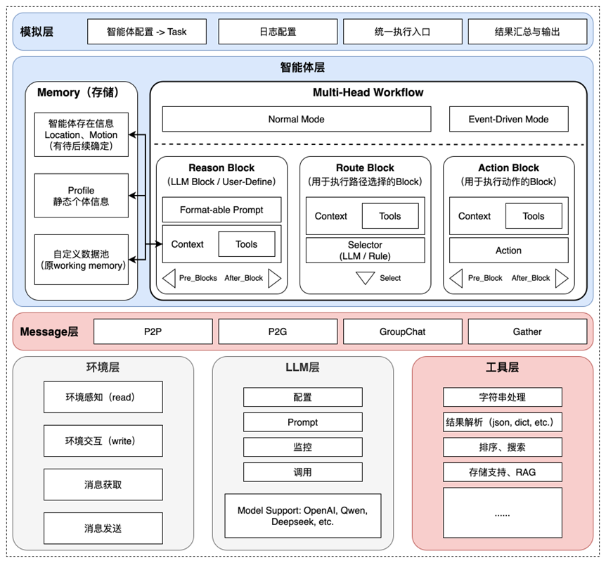

图1-5：仿真实验平台系统架构

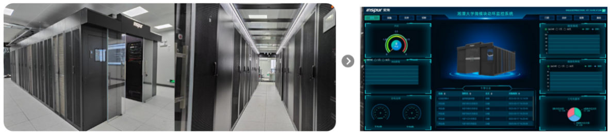

图1-6：湖南国家应用数学中心的超级异构并行计算平台

项目已与**中国科学院苏州纳米技术与纳米仿生研究所**、英国利物浦大学等多单位达成初步合作，并取得了我校**湖南国家应用数学中心**的超级异构并行计算平台中浪潮AIStation的使用权限，如图1-6所示。相关论文《柔性自粘EMG网与原位凝胶的早期腰椎疾病的诊断》已投稿**《Infomat》**，IF=**22.7**。用于超参数调优的**发明专利**《一种基于双种群进化算法的多目标约束优化方法及系统》已申请。使用进化神经架构搜索优化大模型架构的论文，已投稿**SCI一区**《Swarm
and Evolutionary
Computation》，IF=8.2。上述论文、专利，团队成员均作为其中的**作者**。通过该设备，用户能够实时获取腰椎健康状况数据，为腰椎疾病的预防和早期诊断提供有力支持，如图1-7所示。将项目应用于大学生职业生涯规划目标确定，团队成员收到卫视新闻联播专题采访，**新华网、湖南日报**等官媒报道。

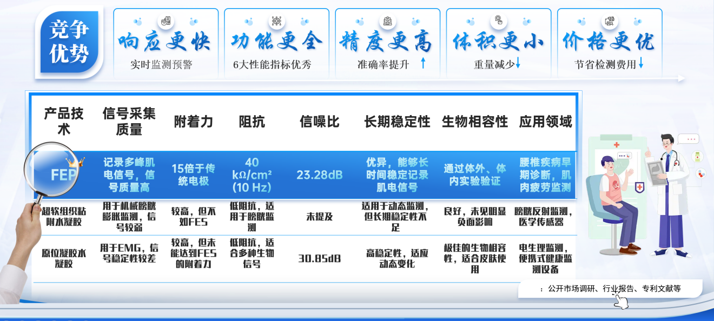

图1-7：竞品分析

1.3 研究现状

1.3.1 学术实务

**久坐场景下的EMG信号检测工具需综合解决技术与生理挑战。**在现代社会，设计用于久坐场景的EMG信号检测工具需应对久坐时间、个体生理差异及技术瓶颈等多重挑战，因久坐引发的腰椎问题（如椎间盘突出、椎管狭窄）日益严重。EMG技术通过非侵入式（如表面EMG，sEMG）或侵入式传感器采集肌肉电活动，已广泛应用于神经肌肉疾病诊断、康复医学及人机交互，依赖高精度硬件与先进算法。然而，sEMG面临信号干扰（运动伪影、噪声、肌肉间串扰）、低空间分辨率（难以捕捉深层肌肉活动）及个体差异（皮下脂肪、皮肤阻抗）的限制；技术上，实时处理与算法复杂度的矛盾及多通道数据的高维性也制约了应用。

近年来，**导电离子水凝胶**作为一种新型材料，因其**电双层电容（EDL）**的优势，在**生物电信号监测**领域展现了巨大潜力\[22,23\]。导电水凝胶电极凭借其卓越的生物相容性和高导电性，已成功应用于**肌电图（EMG）信号**采集和**人机交互**系统中。例如，中山大学**王昊**团队开发了一种**导电聚合物基水凝胶（图1-8）**，并成功实现了**91.28%的手势识别解码准确率**，显著提升了人机交互效率\[24\]。

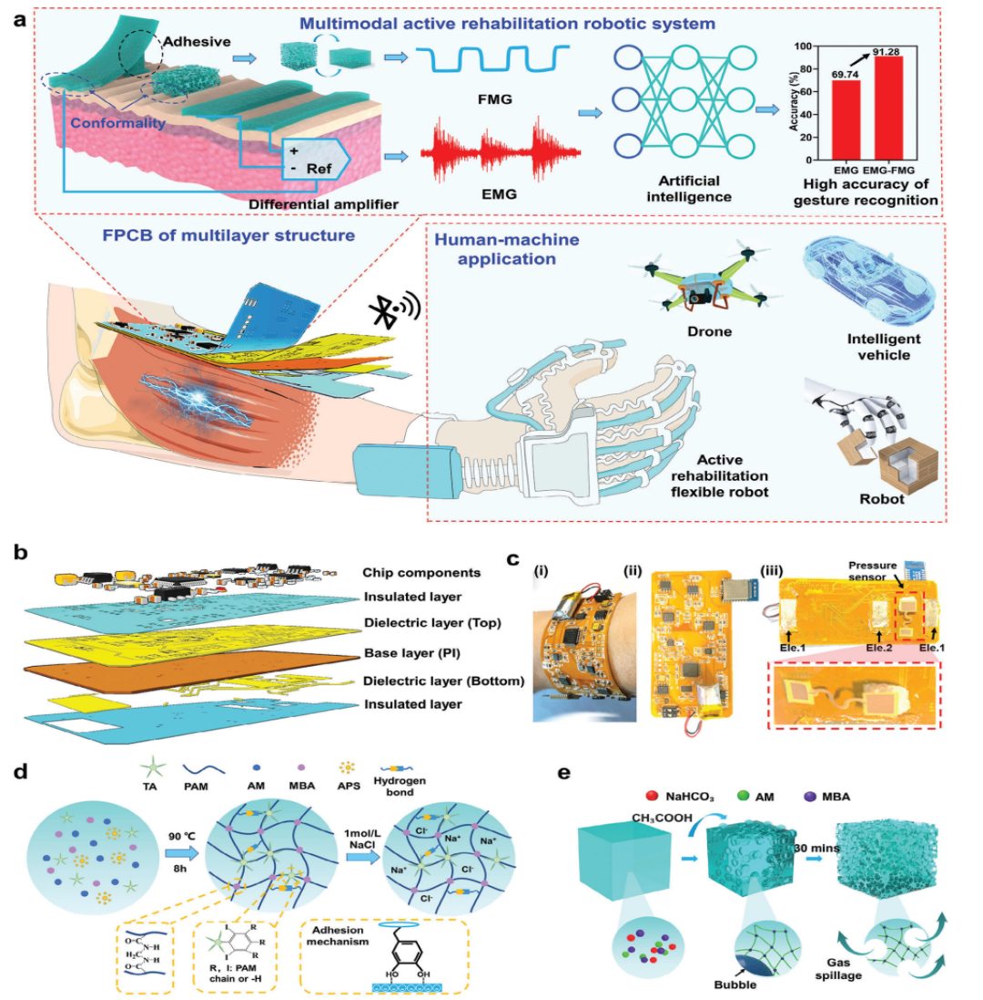

1)  基于水凝胶的肌电图和压力传感器的可穿戴人机交互界面示意图。b) 自行设计的柔性印刷电路板（FPCB）的多层结构示意图。 c) 显示
    FPCB 与人体皮肤的弯曲和保形接触的照片（i）；人机界面的正面照片（ii）和人机界面上传感器的分布情况（iii）。

> 图 1-8：王昊团队导电聚合物基水凝胶

此外，韩国科学技术院Byungkook Oh团队提出了一种**超软组织粘附水凝胶（图1-9）**，其模量低至1
kPa，并成功应用于多功能传感器，用于膀胱排尿反射及EMG信号的精准诊断\[25\]。这些研究为肌电信号的采集和处理提供了坚实的理论基础和实验支持，展现了导电水凝胶在**生物信号监测**中的广泛应用前景。

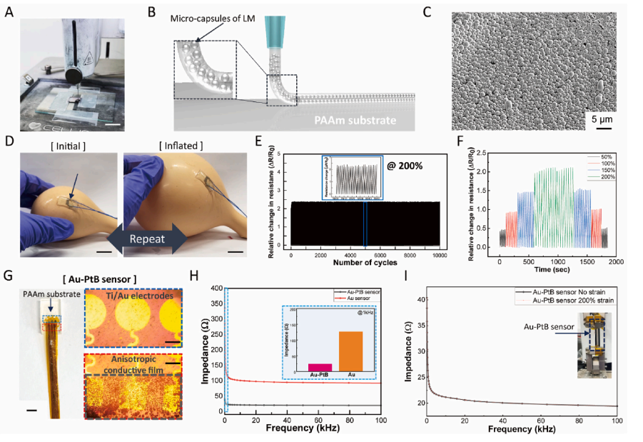

1.  EGaIn\*（EGaIn 液体金属粒子）在 PAAm 基底上的半月板引导涂层照片。比例尺，10 毫米；（B）在 PAAm 基底上印刷
    EGaIn\* 的示意图；（C）在 PAAm 基底上印刷 EGaIn\* 的扫描电镜图像；（D）使用人工膀胱模拟排尿的照片。刻度线，5
    毫米；（E）应变传感器在 200% 应变下重复 10,000 次循环后的相对电阻变化图；（F）各种应变下的相对电阻变化图； (G)
    EMG 传感器的照片（比例尺，5 毫米）和光学显微镜图像，以及顶部集成的各向异性导电膜（比例尺，100 微米）；(H)
    有铂金黑涂层和无铂金黑涂层的金 EMG 传感器的阻抗与频率关系图；(I) EMG 传感器在 200%
    应变前后的阻抗与频率关系图。

图1-9：韩国科学技术院Byungkook Oh团队提出了一种超软组织粘附水凝胶

1.3.2 积累问题

<table>
<thead>
<tr class="header">
<th>问题类别</th>
<th>具体问题</th>
</tr>
</thead>
<tbody>
<tr class="odd">
<td>信号干扰与低信噪比问题</td>
<td><ul>
<li>
长时间坐姿导致肌肉活动微弱，信号容易受到噪声干扰（如运动伪影和背景噪声）。
</li>
<li>
传统表面EMG（sEMG）技术在低信噪比环境下采集信号困难。
</li>
<li>
肌肉间串扰和电极移动进一步影响信号质量。
</li>
</ul></td>
</tr>
<tr class="even">
<td>个体生理差异</td>
<td><ul>
<li>
皮肤阻抗、皮下脂肪厚度、汗液分泌等个体差异影响EMG信号的质量和稳定性。
</li>
<li>
不同个体的皮肤条件可能导致信号强度和稳定性差异。
</li>
</ul></td>
</tr>
<tr class="odd">
<td>水凝胶的稳定性和长期粘附问题</td>
<td><ul>
<li>
导电水凝胶虽然具有优异的导电性和生物相容性，但长期佩戴时稳定性不足，容易受到温度变化、湿度变化和皮肤摩擦等因素影响，导致粘附力减弱。
</li>
<li>
尽管原位凝胶水凝胶在粘附性方面有所改进，但在长时间佩戴中的耐久性依然是挑战。
</li>
</ul></td>
</tr>
<tr class="even">
<td>实时数据处理与算法复杂度问题</td>
<td><ul>
<li>
多通道EMG信号采集产生的大量数据增加了处理复杂度。
</li>
<li>
如何平衡实时性与高维度数据的处理仍然是技术瓶颈，尤其是在便携设备上。
</li>
<li>
深度学习算法虽然有效，但计算资源需求高，限制了实时性。
</li>
</ul></td>
</tr>
</tbody>
</table>

2. 解决方案

2.1 方案提出

本文提出了一种创新的柔性肌电图贴片设计方案，核心在于原位凝胶化水凝胶的应用。该装置整合了低模量网状电极（杨氏模量1.8MPa）、原位凝胶化水凝胶界面（粘附力0.3N/cm，界面阻抗40kΩ/cm²）以及电气信号采集系统，通过细微肌电信号监测与疲劳评估，显著增强了肌肉疲劳和腰椎疾病的早期诊断能力。网状电极的柔性确保贴合皮肤的舒适性与动态适应性；原位凝胶水凝胶直接在皮肤表面固化，提供稳定的信号传输通道和高信噪比（23.28dB）；电气信号采集系统则支持多峰EMG信号的精确捕捉与分析。

实验表明，该设计在长时间坐姿场景下能够有效识别肌肉疲劳的渐进阶段，用户群体如图2-1所示，为腰椎健康管理提供了高效、便携的解决方案，展现出卓越的临床应用潜力。

图2-1 ：用户群体

2.2.1 设计流程

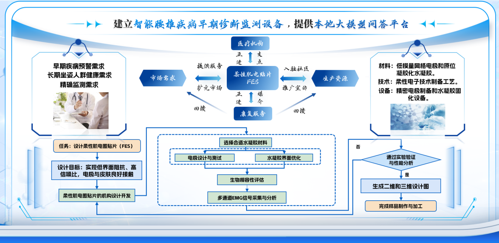

> 图2-2：基本模式和设计开发流程图

2.2.2 技术特点

柔性肌电贴片（FEP）通过多项技术创新，显著提升了微弱肌电信号采集的稳定性、精确性及应用范围。以下为其主要技术特点的详细阐述：

1.  低模量网状电极与原位凝胶化水凝胶界面设计

产品采用低模量网状电极（杨氏模量1.8
MPa），其高柔性设计使其能够紧密贴合皮肤并适应动态变化，确保长期佩戴中的电气连接稳定性。搭配原位凝胶化水凝胶（由明胶和毗啶烷酮磺酸钠制成），该水凝胶在皮肤表面快速固化，提供0.3
N/cm的强粘附力，有效降低因运动或姿势调整导致的脱落风险。这种协同设计将界面阻抗降至40 kΩ/cm²，同时实现23.28
dB的高信噪比，使其在长期坐姿等场景下能够稳定采集微弱EMG信号，精确反映肌肉疲劳引起的信号变化。

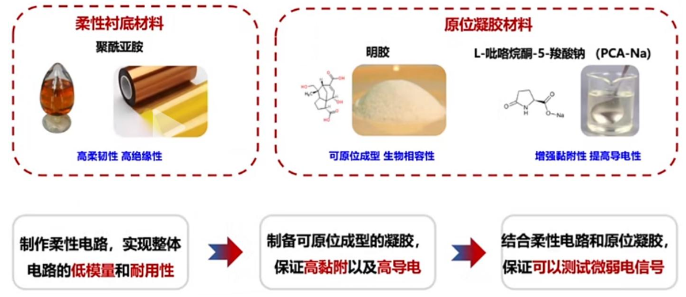

图2-3：制作流程

2.  多峰肌电信号采集与分析

相较于传统电极仅能捕捉单峰信号，具备采集多峰EMG信号的能力，提供更细致的肌肉疲劳信息。通过分析多峰特征，能够精确区分肌肉疲劳的不同阶段，尤其在长期坐姿环境中表现出色。实验显示，产品记录的多峰信号清晰反映了疲劳随时间加剧的过程，频域分析进一步揭示了疲劳特征（如低频成分增强），为腰椎疾病早期诊断提供了可靠数据支持。

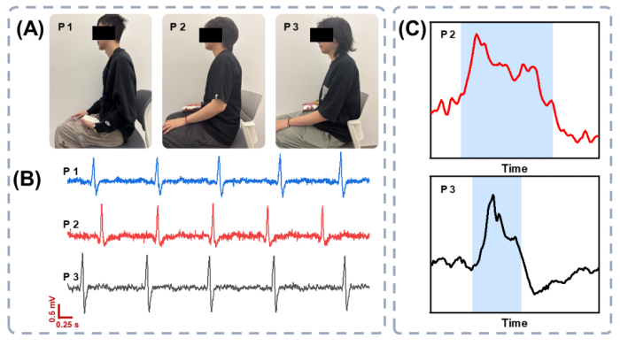

图2-4
（A)（A)三名参与者（P1-P3）长时间坐着时腰部EMG记录的姿势。(B)FES记录的相应EMG信号。(C)坐着时记录的细微多峰EMG特征放大图。

3.  深度学习信号处理与实时分析

产品集成深度学习算法，特别是多视图分支卷积神经网络，实现对EMG信号的处理与分类。通过去噪、特征提取和模式识别，该技术显著提升了微弱信号的分析精度。产品能有效监测肌肉疲劳状态，分类准确率在非疲劳状态下达95%，疲劳状态下为81.67%。这种分析能力增强了其在复杂环境下的诊断可靠性。

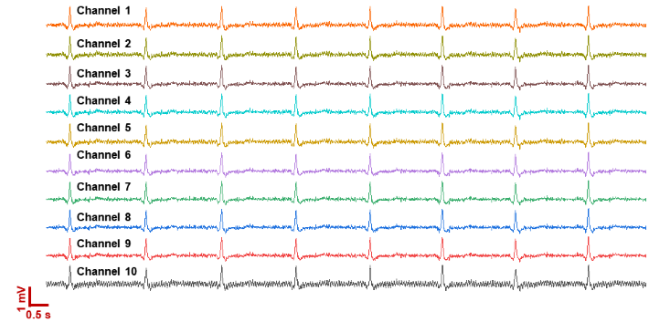

图2-5 腰部记录10通道EMG信号

4.  高灵敏度与多任务适应性

产品展现出卓越的灵敏度和任务适应性。在抓取物体和握力测试等任务中，FEP能够清晰区分不同动作引起的肌肉活动。例如，抓取重物时，EMG信号幅度显著增加，频率范围从低频（0.1-10
Hz）扩展至20-40 Hz或30-50
Hz，反映神经肌肉活动的增强。这一特性使产品不仅适用于肌肉疲劳监测，还可扩展至力学测试和运动相关的生物电信号采集，应用潜力广泛。

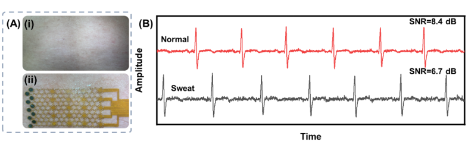

图2-3 (A) 显示了佩戴FEP，1小时运动前（i）和后（ii）的下背部，在此期间可以观察到明显的汗液积累，FEP仍保持与皮肤的粘附。(B)
显示了正常和出汗条件下记录的肌电图（EMG）信号，整体EMG信号保持稳定。

5.  优异的生物相容性与舒适性

水凝胶材料经体外和体内测试，如图2-4，表现出优异的生物相容性，无溶血或细胞毒性反应，其自粘附性（0.3
N/cm）和水分保持性维持了设备在数小时使用中的稳定性与舒适性，避免了传统电极因干燥引起的皮肤刺激或信号衰减。

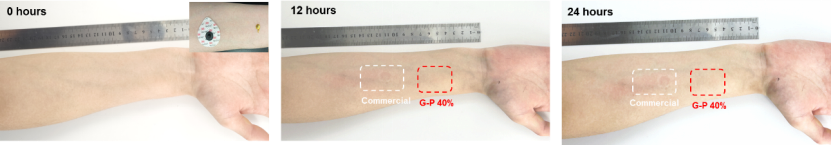

图2-4：用于生物相容性测试的受试者手臂的照片

6.  综合优势

产品通过低模量电极与原位水凝胶的协同设计、多峰信号采集、深度学习分析、高灵敏度及生物相容性优化，全面提升了EMG技术的性能。其在肌肉疲劳监测、腰椎疾病诊断及多任务适应性中的表现，凸显了其在临床、健康管理和人机交互领域的广阔前景。

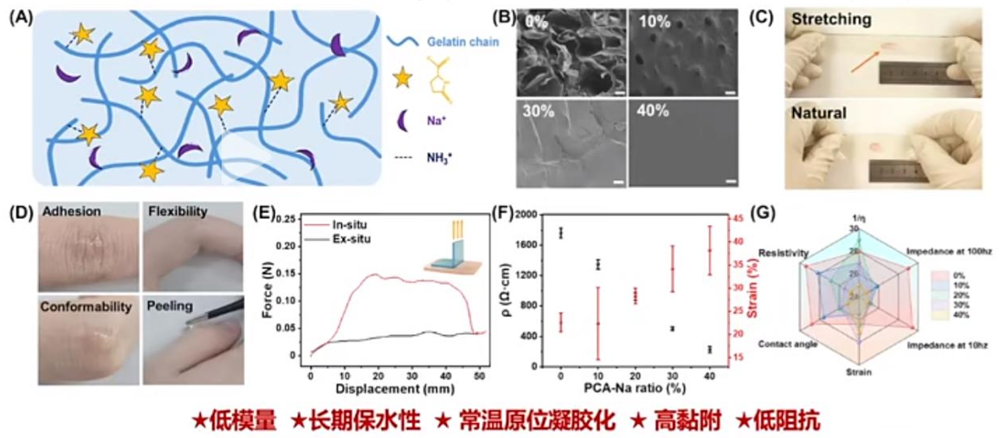

图2-6：基于PCA-Na掺杂的原位凝胶水凝胶的产品性能

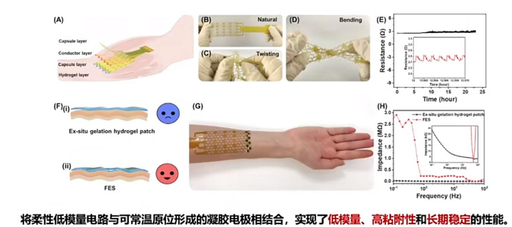

图2-6：基于低模量柔性网状电路与原位形成的水凝胶的肌电电极贴片传感器的产品性能：低模量、高粘附性和长期稳定

2.3 柔性肌电图贴片的结构设计

2.3.1 网状电极结构

如图2-7，柔性肌电图贴片（FEP）采用低模量网状电极（杨氏模量1.8
MPa），通过AutoCAD精确设计，赋予其极高的柔性与皮肤适应性。这一网状结构不仅提升了佩戴舒适度，使电极能够紧密贴合皮肤并适应动态形变，还克服了传统刚性电极在长期使用中易引发的不适与信号不稳定的问题。网状设计显著增大了与皮肤的接触面积，从而优化了信号采集的稳定性与传输效率，为高质量EMG信号监测奠定了基础。

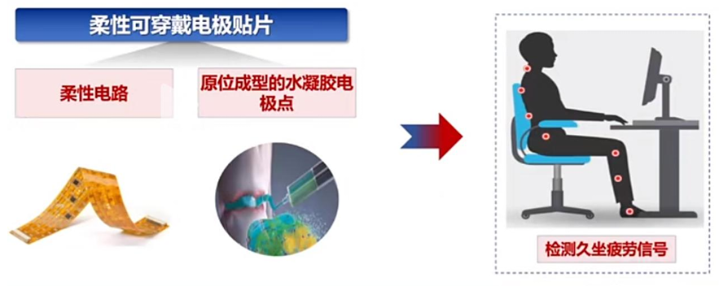

> 图2-7：产品简化原理图

2.3.2 原位凝胶化水凝胶界面

合成过程：水凝胶的制备通过将吡咯烷酮羧酸钠（PCA-Na）加入明胶和去离子水的混合溶液中完成。溶液总重24g，其中明胶固定为4g，PCA-Na比例分别调至0wt%、10wt%、20wt%、30wt%和40wt%，通过控制去离子水含量实现配比调节。混合物在60℃下加热并搅拌2小时，形成均匀的前驱体溶液。随后，前驱体溶液被均匀涂抹于靶部位，或倒入9cm×9cm模具（厚度1mm）中，凝胶化过程约需5分钟。

性能优势：采用原位凝胶化水凝胶作为电极与皮肤的界面，直接在皮肤表面固化，提供0.3
N/cm的强粘附力。这种设计有效填补皮肤微小褶皱，形成稳定的电气接触，避免了传统电极在动态环境中因移位或脱落导致的信号丢失。水凝胶界面阻抗低至40
kΩ/cm²（10 Hz时），结合其高电荷存储容量（8.3 mC/cm²），显著提升了信号传输效率，确保微弱EMG信号的高质量采集。

2.3.3 封装设计

封装层选用聚酰亚胺（PI）作为材料，赋予电极优异的机械强度和电气隔离性能。PI层不仅保护电极免受外界环境（如湿度或机械磨损）的干扰，还有效屏蔽潜在干扰源，提升信号稳定性。导电层采用铜（Cu），凭借其优异的导电性和低电阻特性，确保信号高效传输，减少损耗。这种封装设计为产品在复杂使用场景中的可靠性提供了保障。

2.4 最终设计方案

产品的最终结构整合了低模量网状电极、原位凝胶化水凝胶界面和聚酰亚胺封装层，形成高效、稳定的肌电监测系统。

  - > 网状电极：以铜（Cu）作为导电层，保证电信号传输的高效性与稳定性，同时柔性设计（1.8 MPa）确保与皮肤的动态贴合。

  - > 原位凝胶化水凝胶界面：提供强粘附力（0.3 N/cm）和低界面阻抗（40
    > kΩ/cm²），结合水分保持性，确保设备在长时间佩戴中维持信号质量和舒适性。

  - > 聚酰亚胺封装层：增强机械保护并隔离外界干扰，提升整体稳定性和信号纯度。

2.5 系列实验

2.5.1 材料表征实验

以下是对柔性肌电图贴片（FEP）中关键材料——原位凝胶化水凝胶的力学性能、电导率、形态学、流变学及保水性进行的全面表征实验及其结果分析。

1.  力学性能

先将原位凝胶水凝胶前体浇注于9cm\*3cm\*1mm的猪皮表面测量附着力。接着，冷却10分钟以完全凝胶化。使用FC038V单轴剥离拉伸试验机（中国广东中业晶科精密科学仪器），以60mm/min速度进行90度剥离测试，测量附着力。对比实验中，非原位凝胶水凝胶直接置于猪皮上进行相同测试。

2.  电导率和阻抗

采用RTS-9四探针站（中国4探针科技）测量10mm\*10mm\*1mm水凝胶样品的薄片电阻，通过施加恒流并记录电压降计算电导率。电化学阻抗谱（EIS）测试使用DH7000工作站（中国东华），覆盖0.1Hz-1MHz频率范围。

3.  形态学

使用Sigma-300扫描电子显微镜（CarlZeissAG，德国）获得水凝胶的横截面图像。将制备好的脱位凝胶水凝胶浸入液氮中，直至完全冻结，并迅速转移到真空冷冻干燥机。样品冷冻干燥24小时后，通过轻轻掰开，人工将其切成约10mm\*10mm的切片。切片后的样品随后进行第二次冷冻干燥处理24小时，在成像之前，在样品上溅射涂覆约10纳米厚的铂层。

采用高性能电化学工作站DH7000（中国东华）进行电化学阻抗谱（EIS）和循环伏安法（CV)测量。EIS测量覆盖0.1Hz到1MHz的宽频率范围，而CV实验在标准的三电极配置下进行。其中，Ag/AgCl电极（2MKCI）作为参比电极，表面积为1cm²的铂电极作为反电极。信号采集和分析使用TBS2000B数字示波器（泰克公司，USA）进行，确保了电信号的高精度记录。此外，G-P样品的电学性质，包括电流-时间（I-t）曲线，使用Keithley2450数字源计（泰克公司，USA）精确表征。所有测试样品均使用非原位凝胶水凝胶制备，尺寸严格控制在10mm\*10mm\*1mm，确保实验结果的一致性和可重复性。

4.  流变学表征

在温度斜坡模式下进行流变学测量，以评估各种水凝胶的机械性能。采用Discovery
HR-2流变仪（WatersTechnology，USA)，配备25mm直径平行板（1mm间隙）和温控珀尔帖板。在大约60°C下，将水凝胶前体溶液应用于珀尔帖板，确保平行板之间的间隙完全填充。随后，以5℃/min的速率从60℃至10℃进行温度斜坡试验，振荡频率为5
rad/s，振荡幅度为1%，测量机械性能。

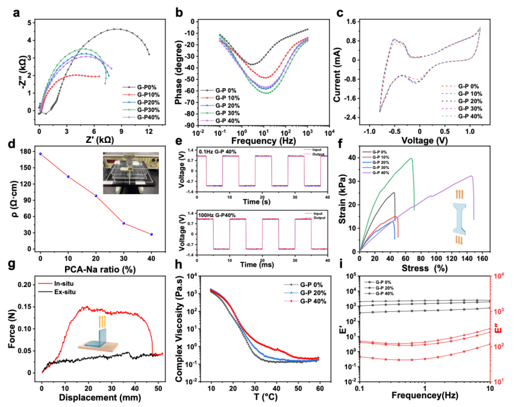

(a)-(b) G-P
0%、10%、20%、30%和40%时的EIS光谱和相角响应。(c)G-P循环伏安曲线。(d)G-P片材电阻。(e)G-P40%在不同频率下的输入输出电压波形。(f)不同G-P下水凝胶的应力-应变图。(g)原位凝胶和非原位凝胶在猪皮上剥离力的比较。(h)不同G-P的复合粘度。(i)
G-P 0%、G-P 20%和G-P 40%在拉伸应变频率0.1～10Hz下的流变特性。

图2-8 G-P的电气、机械、粘接和流变性能。

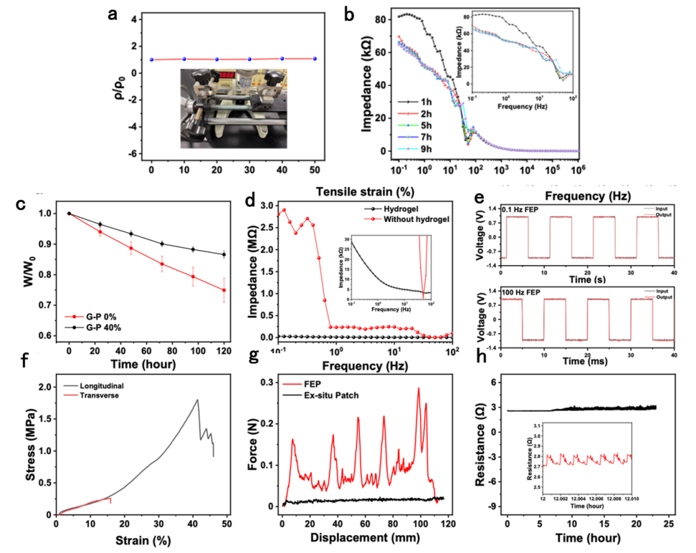

(a)拉伸变形下G-P40%归一化电阻率变化。(b)在0.1H-10000 Hz频率下，G-P 40%在9小时内的阻抗。(c)
0%G-P和40%G-P的保水性比较。(d)FEP与电极的界面阻抗比较。(e)FEP在0.1Hz和100Hz不同频率下的输入和输出电压波形。（f)FEP纵向和横向应力-应变曲线。（g）原位凝胶和非原位凝胶贴片在猪皮上的粘附强度比较。（h）24小时内600次循环拉伸后贴片的阻力变化情况

图2-9 原位凝胶水凝胶与电极之间的组装性能

2.5.2 生物相容性实验

本研究对FEP水凝胶的生物相容性和安全性进行了全面评估。首先，将0.1g水凝胶浸泡在10mL培养基中，持续24小时，制备水凝胶提取物。然后，将人真皮成纤维细胞（HDFs，Procell，武汉）暴露于提取物中，暴露时间为1天或3天。暴露后，使用Live/Dead荧光试剂盒（R37601，Invitrogen）对细胞进行染色，并在荧光显微镜下观察细胞活力。此外，CCK-8测定法（Beyotime
Biotechnology,Shanghai,China）定量评估细胞活力，暴露1小时后，在450nm处测量吸光度。此外，进行溶血试验，将新鲜小鼠血细胞稀释至5%
w/v浓度，并与水凝胶在37°C下孵育1小时，记录上清液在540nm处的吸光度，计算溶血率：（ODn-ODc）/(ODs-ODc)\*100%，其中ODn、ODc和ODs分别代表水凝胶、PBS和去离子水的吸光度。为评估体内组织相容性，在植入水凝胶后3天，收集小鼠主要器官并进行苏木精-伊红（H\&E）染色。实验期间，动物护理严格按照宁波大学动物护理与使用委员会的正式授权执行（批准号12312）。小鼠在12小时明暗循环下饲养，自由获取食物和水。在手术前，使用50mg/kg戊巴比妥钠对小鼠进行麻醉。水凝胶植入8周龄雄性C57BL/6小鼠体内3天。随后对小鼠进行安乐死，提取植入区域及周围皮肤组织进行组织学分析，使用H\&E、甲苯胺蓝（TB）和马松三色（MT）染色进行详细检查。（如图2-6）

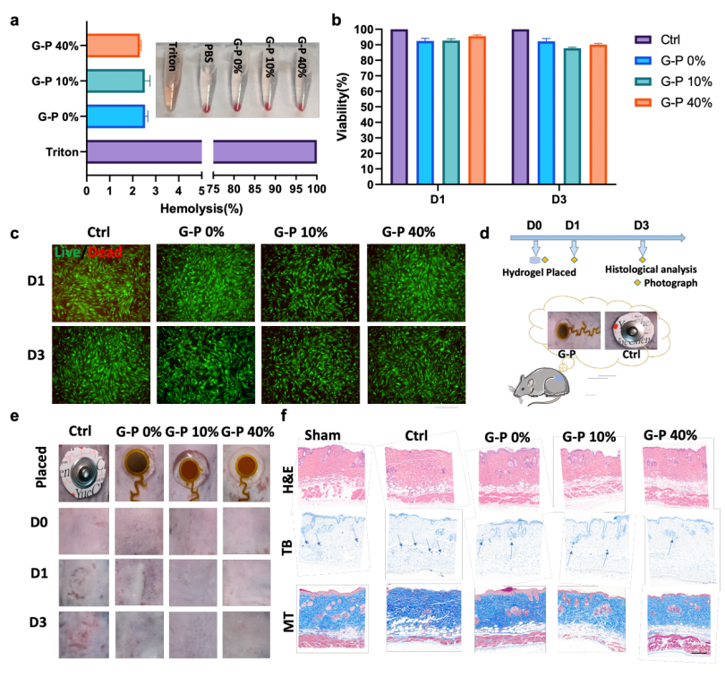

(a)溶血的照片和定量分析，以水凝胶的溶血率（%）表示。（b）不同水凝胶处理1天和3天后L929细胞活力的评估。（c）不同水凝胶处理1天和3天后人真皮成纤维细胞的活/死染色结果（比尺：100Pm）。（d）G-P水凝胶体内试验方案示意图。（e）植入G-P水凝胶的小鼠背部光学图像。（f）放置后3天的组织学评价，采用苏木精和伊红（H\&E)、甲苯胺蓝（TB）和马松三色（MT）染色（比尺：200um）。蓝色箭头表示炎症细胞。数据以均数士标准差（n=5）表示。

图2-10 G-P的生物相容性评价

2.5.3 EMG监测和疲劳状态检测

本研究监测健康受试者的EMG信号，实验方案经过研究伦理审查委员会（ER-LRR-11000048720231102134017）批准。所有EMG信号均使用Sessantaquattro+EMG记录仪（OTbioeletronica
s.r.l.，意大利）进行记录。实验中，将原位凝胶水凝胶前体小心涂抹于皮肤上，精确覆盖电极和粘附区域，确保前驱体与电极紧密接触。水凝胶在约5分钟内完成凝胶化，形成强粘附力后，使用Sessantaquattro+EMG记录仪记录EMG信号。

肌肉状态的分类分为三个步骤：数据预处理、特征提取和分类。数据预处理的目的是去除噪声和伪影。首先，应用带通滤波器对原始信号进行滤波，保留200-500Hz的频率范围，以监测细微的EMG信号。接着，采用小波变换去除随机噪声，并利用独立分量分析（ICA）消除伪信号。使用动态基线和阈值进行波峰和峰谷检测，信号被分为多个波段。提取特征用于进一步分析。

特征提取阶段使用多个独立的提取器，从原始数据中提取有用信息，为后续的模型训练做准备。时域、频域和小波特征作为独立视图进行处理，之后通过张量化将特征转化为适用于深度学习模型的格式。分类采用多分支卷积神经网络（CNN）模型，基于多视角特征对疲劳信号进行分类。多分支卷积模块提取不同尺度的信号特征，残差融合改进了这些多尺度特征的表示。特征级融合连接来自不同视角的特征，从而生成更全面的特征表示。最终，经过一个完全连接的层进行分类，并采用合成少数派过采样技术（SMOTE）解决不平衡问题。训练过程中使用Adam优化器优化学习过程，学习率调度器增强了收敛性，保证了模型的效率与准确性。

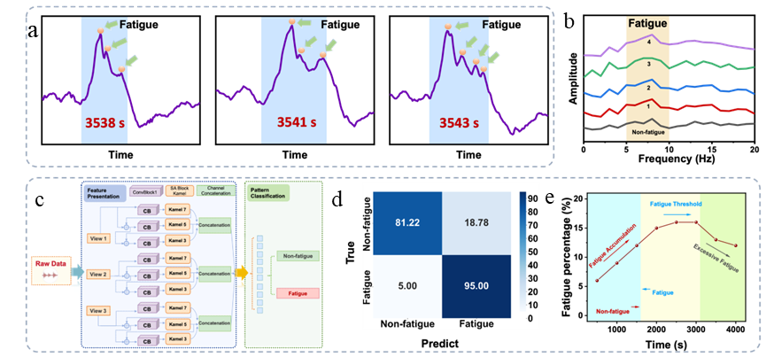

> 图2-11：(a) 产品成功监测到不同疲劳状态下的微弱肌电信号；(b)
> 在不同时间间隔（1、2、3和4）下，非疲劳和疲劳状态下肌电信号的频域分析；(c)
> 用于肌电信号分类的人工神经网络架构；(d) CNN模型在验证集上的混淆矩阵；(e) 长时间坐姿疲劳分类图。

6.  部署本地大模型

2.6.1 模型训练与优化

1\. 功能描述

模型训练与优化模块通过继续预训练和多种微调技术提升大规模语言模型的生成能力和任务适应性。该模块结合数据清洗、数据转换和特殊token配置，优化训练效率，并通过自动合并adapter层与base模型权重，进一步提高生成效果。

1.  主要功能点

<!-- end list -->

  - > 模型预训练：继续对大模型进行预训练，增强模型的基础能力。

  - > 微调技术：

> （1）QLoRA微调：使用量化的低秩适配器（QLoRA）技术，通过冻结的4位量化模型将梯度反向传播到低秩适配器，优化内存使用和资源利用率，专注于特定任务的学习；
> 
> （2）SFT：在预训练模型的基础上，通过有标签的训练数据进行微调，使模型在特定任务上表现更好；
> 
> （3）DPO：直接优化模型的偏好，通常用于强化学习和策略优化任务，通过调整模型以符合用户的偏好或需求来提高性能。

  - > 优化与合并：合并adapter层与base模型权重，优化模型参数，提升文本生成结果的专业性。

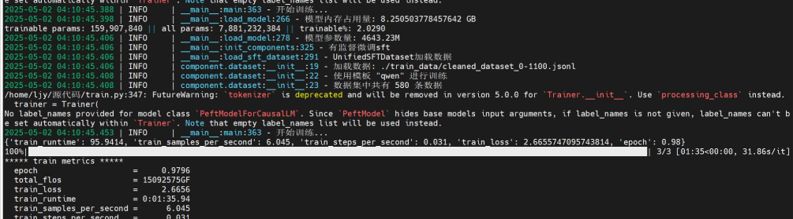

> 图2-12：大模型LLM微调

2.6.2 知识库构建与管理

1\. 功能描述

知识库管理模块负责系统内知识库的构建、更新和维护。该模块支持多类型文档的上传、向量嵌入生成和信息检索，提高问答系统的知识覆盖范围和回答准确性。

2\. 主要功能点

  - > 文档上传：通过前端界面上传各种类型的文档，包括PDF、Word、CSV等。

  - > 向量处理：利用本地化的“知识库构建”模块将上传的文档内容进行文本分割和向量化处理。向量化过程支持自定义文本切分参数，如chunk\_size和chunk\_overlap，以适应不同课程与类型文件的要求。

  - > 向量存储：生成的向量嵌入将存储在Chroma向量数据库中，支持信息检索和问答生成，提升系统的知识覆盖范围。

  - > 信息检索：在用户提出问题时，系统通过RAG机制，结合实时检索结果生成准确的回答。RAG机制利用向量数据库中的知识信息，增强生成模型的知识覆盖和回答准确性。

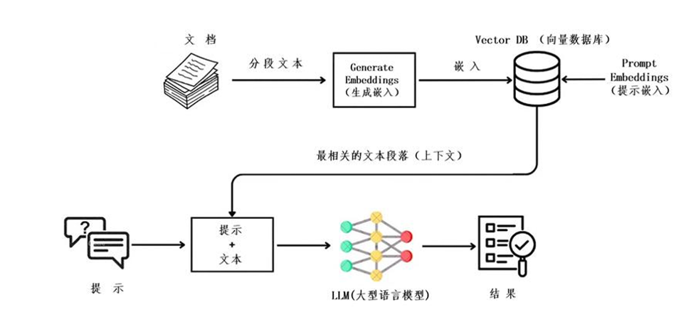

图2-12： RAG检索机制

2.6.3 计算资源与开发工具

配备NVIDIA Tesla V100
GPU集群及高性能计算节点，支持千亿级参数模型分布式训练与实时推理；基于Python-MATLAB混合编程环境。

6.  仿真实验平台

构建动态虚拟社会环境，仿真实验平台是一个基于大语言模型（LLM）驱动的大规模社会模拟平台，旨在帮助模拟FEP产品在人群中的推广路径及久坐行为诱发的腰椎疾病风险传播规律。该平台通过结合LLM
智能体（Agent）、真实社会环境建模和高性能计算引擎，能够模拟超过10,000个智能体及其500万次互动，为产品市场策略与疾病预防政策提供量化依据。

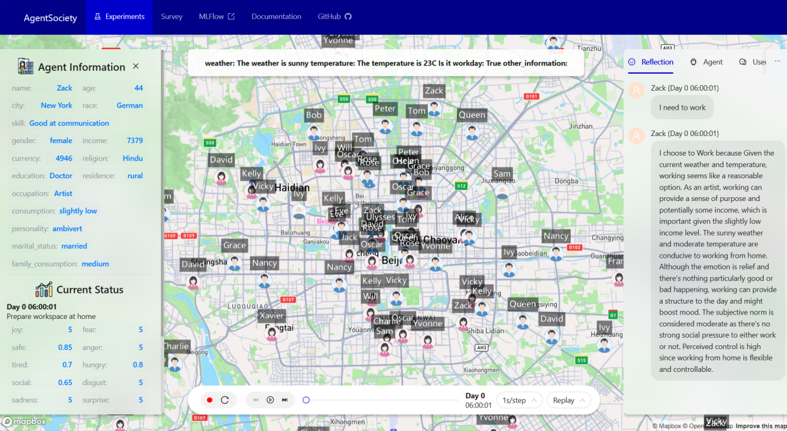

图2-13： ABM+LLMs双核驱动的仿真实验平台界面01

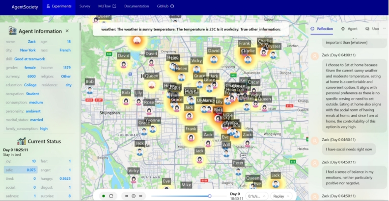

图2-14：仿真实验平台界面02

2.7.1 大语言模型（LLM）驱动的智能体

仿真实验平台的核心在于其高度拟人化的智能体，这些智能体由大语言模型（如 GPT 类模型）驱动，具备：

  - > 人类般的认知和决策能力：智能体能理解自然语言、进行推理、记忆历史行为，并基于个体目标和社会情境做出决策。

  - > 情感与需求模拟：智能体拥有情感状态（如快乐、压力等）和基本需求（如社交、经济、安全等），影响其行为模式。

  - > 个性化行为生成：不同智能体具有不同的性格、职业、经济状况，能够模拟真实的消费、就业、社交互动等社会行为。

2.7.2 真实社会环境建模

平台构建了一个高度仿真的虚拟社会环境，包括：

  - > 城市空间：如住宅区、商业区、公共场所，智能体可在这些区域自由移动并交互。

  - > 经济系统：模拟市场交易、就业、收入分配等经济现象，研究贫富差距、消费行为等。

  - > 社交网络：智能体之间可以建立社交关系，模拟友谊、竞争、合作等人际互动。

2.7.3 大规模并行计算引擎

为了支持超大规模社会模拟（10,000+ 智能体），平台采用：

  - > Ray分布式计算框架：高效管理智能体的并行计算，确保模拟的扩展性和稳定性。

  - > MQTT消息协议：专为物联网（IoT）优化的轻量级通信协议，支持百万级智能体的实时交互，确保低延迟和高吞吐量。

2.7.4 平台优势及潜在应用场景

1\. 平台优势

表1：仿真平台优势

| 优势    | 说明                                 |
| ----- | ---------------------------------- |
| 高仿真度  | LLM 驱动的智能体行为更接近真实人类，而非传统规则控制的行为模型。 |
| 可扩展性  | 支持 10,000+ 智能体并行计算，适用于超大规模社会系统研究。  |
| 灵活性   | 可调整经济、政策、社会环境参数，模拟不同社会情境。          |
| 低成本实验 | 相比真实社会实验，计算机模拟成本更低，且可重复验证。         |
| 跨学科应用 | 适用于社会学、经济学、心理学、政治学等多种研究需求。         |

2\. 潜在应用场景

（1）社会科学研究

  - > 社会不平等研究：模拟贫富差距、教育机会不平等的影响因素。

  - > 群体行为分析：如谣言传播、社会运动、集体决策的形成机制。

  - > 政策评估：测试新政策（如最低工资、税收改革）对社会经济的影响。

（2）商业与市场分析

  - > 消费者行为模拟：预测市场趋势、新产品接受度。

  - > 供应链与劳动力市场模拟：优化企业招聘、薪资策略。

（3）城市规划与管理

  - > 人口流动模拟：预测城市扩张对交通、住房的影响。

  - > 灾害应对：模拟疫情传播、应急管理措施的效果。

2.8 创新性与先进性

2.7.1 创新性

1.  低模量网状电极与水凝胶界面创新集成设计；

2.  深度学习分析的监测分析EMG；

3.  多峰肌电信号采集提升久坐分析的精确性与应用价值；

4.  高灵敏度与多任务适应性，生物相容性与舒适性的平衡;

5.  构建本地大模型问答拓展医疗应用；Qlora技术微调、RAG检索机制。

6.  仿真实验平台采用"ABM+LLMs"双核驱动，支持多维度环境建模。

7.  仿真平台可进行超大规模社会模拟、观察智能体决策逻辑

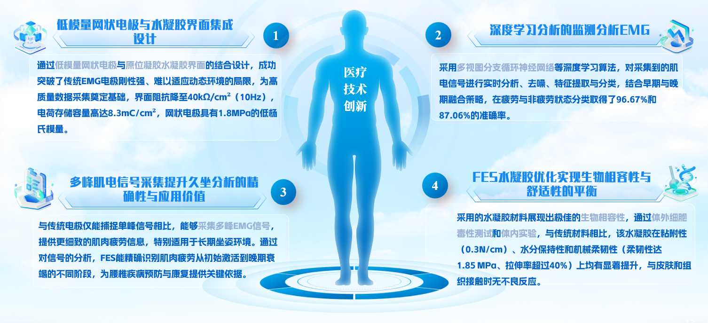

图：创新性01

2.7.2 先进性

相关论文《柔性自粘EMG网与原位凝胶的早期腰椎疾病的诊断》已投稿《Infomat》，IF=22.7。用于超参数调优的发明专利《一种基于双种群进化算法的多目标约束优化方法及系统》已申请。使用进化神经架构搜索优化大模型架构的论文，已投稿SCI一区《Swarm
and Evolutionary Computation》。上述论文、专利，团队成员均作为其中的作者。

相关领域的系列研究，已产出多篇高影响因子论文，并获得相关专利。如下：

【论文】：

1.  Y. Sun, Z.D. Xie, P.Y. He, G.Z. Xu, X.F. Wang\*. Wet Adhesion on
    Rough Surfaces: A JKR Model with Thermodynamic
    Considerations, International Journal of Solids and Structures,
    2024, 292:112714.

2.  Y. Sun, P.Y. He, Z.D. Xie, Y.C.Y. Liu, W.J. Xia, X.F. Wang\*, An
    anti-impact principle for skin-interfaced devices with a layered
    structure, Extreme Mechanics Letters, 2023, 63:102046.

3.  X.F Wang\*, J. Huang, Y. Liu, J.Y. Tan, S.D. Chen, Raudel Avila,
    Z.Q. Xie\*.  Design of protective and high sensitivity encapsulation
    layers in wearable devices, SCIENCE CHINA Technological Sciences,
    2023, 66:223-232.

4.  X.F. Wang, Y.X. Zhang, S.D Chen, Y.G. Xue, H.W. Luan, Y.J. Ma\*.
     Anti-self-collapse design of reservoir in flexible epidermal
    microfluidic device via pillar supporting, Applied Physics Letters,
    2018, 113:163702.

5.  Y.C.Y. Liu, X.F. Li, H. Yang, P. Zhang, P. Wang, Y. Sun, F. Yang, W.
    Liu, Yu. Li, Y. Tian, S. Qian, H. Cheng\*, X.F.
    Wang\*.  Skin-interfaced Superhydrophobic Insensible Sweat Sensors
    for Evaluating Body Thermoregulation and Skin Barrier Functions, ACS
    nano, 2023, 17(6):5588-5599
    (封面论文，ESI高倍引论文)). (被中国科学报（首版要闻）、科学网、湘潭日报、News
    Break, Science Daily等国内外媒体广泛报道)

6.  W.Y. Liu, H. Cheng\*, X.F. Wang\*. Skin-interfaced colorimetric
    microfluidic devices for on-demand sweat analysis, NPJ Flexible
    Electronics, 2023, 7(1):43.

7.  Y. Zhang, Y. Chen, J. Huang, Y. Liu, J. Peng, S. Chen, K. Song, X.
    Ouyang, H. Cheng\*, X.F. Wang\*.  Skin-interfaced microfluidic
    devices with one-opening chambers and hydrophobic valves for sweat
    collection and analysis, Lab on a Chip, 2020, 20, 2635-2645. (封面文章)
    (被数十家国外媒体报道(包括：Science News, News Break, Science
    Daily, Phys.org等)，入选该期刊2021年度21篇最具影响力的文章).

【专利】：

1\. 基于全卷积残差网络的肌电信号手势识别方法及系统，ZL202210411532.9

2.一种具有应变隔离效应的柔性应变传感器，ZL20191060124.8

3.一种基于双种群进化算法的多目标约束优化方法及系统，在投

本项目在EMG信号监测技术领域具有显著的先进性，具体体现在以下几个方面：

（1）原位凝胶水凝胶界面的创新突破

本项目的原位凝胶水凝胶界面是相较于传统电极材料的最大亮点之一。传统水凝胶需预先凝胶化并依赖额外粘合剂涂抹，而FEP采用原位凝胶化技术，利用明胶和毗啶烷酮磺酸钠(PCA-Na)直接在皮肤表面形成紧密界面。这种设计不仅提升了粘附力（0.3N/cm）和稳定性，还将界面阻抗降至40kΩ/cm²（10Hz），显著优于传统技术。其卓越的电导性能和高电荷存储容量（8.3mC/cm²）为微弱EMG信号的稳定采集提供了可靠保障，彻底消除了额外粘合剂的需求。

（2）适应长时间佩戴的稳定性和舒适性

FEP通过水凝胶的水分保持性和网状电极的柔性设计（杨氏模量1.8MPa），实现了长时间佩戴下的信号采集稳定性。水凝胶的保湿性避免了传统电极因干燥导致的信号衰减或皮肤不适问题，即使在数小时的坐姿监测中也能维持高信噪比（23.28dB）。此外，电极与皮肤的高度贴合性确保了佩戴舒适度，减少动态环境下的移位风险，使FEP特别适合需要持续监测的场景。

（3）优异的生物相容性保障安全性

FEP采用的水凝胶材料展现出极佳的生物相容性，经过体外细胞毒性测试和体内实验，未发现溶血、过敏或组织刺激反应，证明其在长时间皮肤接触下的安全性。与传统材料相比，该水凝胶在粘附性（0.3N/cm）、水分保持性和机械柔韧性上均有显著提升。这种优化确保了FEP在各种使用环境（如久坐或动态活动）中的可靠性和用户舒适性，为临床应用奠定了基础。

（4）多峰EMG信号采集与深度学习分析的精准监测

FEP突破传统电极单峰信号的局限，能够采集多峰EMG信号，提供更细致的肌肉疲劳信息，尤其适用于长期坐姿场景下的阶段性疲劳检测。通过结合多视角分支循环神经网络等深度学习技术，FEP实现了信号的实时处理、去噪和分类。其高分辨率数据揭示了肌肉从初始激活到疲劳衰竭的多阶段特征，显著提升了微弱信号的识别精度。实验证明，这种方法在动态环境下仍能保持稳定性和高信噪比，为肌肉疲劳监测和腰椎疾病预警提供了强大的技术支持.

3. 实验推进计划

3.1 实物展示

如图3-1，这款柔性肌电贴片（FEP）是一项创新的健康监测设备，采用原位凝胶化水凝胶和低模量网状电极设计。它能够在皮肤上直接形成一个稳定的电极界面，确保长期佩戴时的信号稳定性和高效性。FEP能够精准采集微弱的肌电信号，尤其适合于长时间坐姿下的腰椎健康监测，帮助用户有效监控肌肉疲劳的变化。

FEP通过深度学习技术实时分析采集到的信号，并对肌肉疲劳状态进行高准确率的分类。其在腰椎疾病的早期诊断、个性化康复方案的制定方面具有广泛的应用潜力，特别是针对现代人长时间坐姿的生活方式，填补了精确、舒适和便捷健康监测的市场空白。

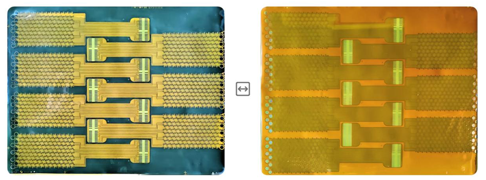

图3-1 贴片正反面

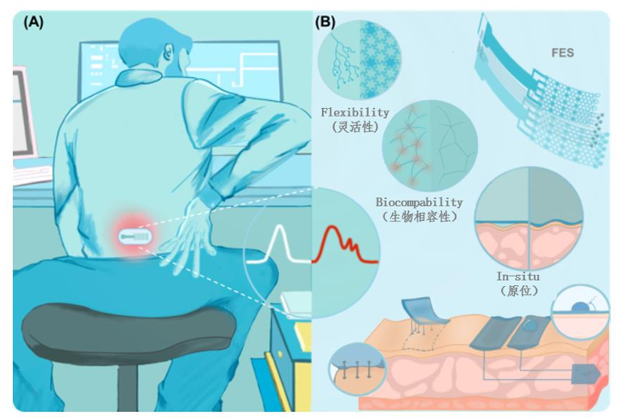

图3-2
FES/FEP示意图。（A）在长时间坐姿下实现稳定的EMG信号监测，以及监测EMG信号时非疲劳状态和疲劳状态的比较。（B）FES由PI层封装的Cu导电层和原位凝胶水凝胶界面组成，表现出优异的柔韧性和生物相容性。

3.2 肌电贴片的实际使用过程

使用过程：使用肌电贴片（FEP）时，将置于表层的保护膜轻轻揭下，将贴片予手臂关节处向下延伸约三指处，及腰椎中部向上莫约一指。注意，使用时应将贴片末端的五块小电极接附于皮肤表面，以便于精确肌电图的展示，产品表面使用了导电聚合物基水凝胶，可直接凝胶于皮肤之上，并产生强粘附力，无需额外的皮肤制备或粘合剂。

肌电图提取过程：如图3-2中志愿者所示，将原位凝胶水凝胶前体物质小心地滴加到皮肤上，精确地覆盖对应于电极的位置。还有粘附区域。在施加前体物质之后，将电极贴片轻轻地按压在皮肤上，以确保最佳接触。在大约
5 分钟内，水凝胶完成凝胶化，这会在 FEP 和皮肤之间形成牢固的粘附，然后使用 Sessantaquattro+
电动肌电图记录仪记录EMG信号。

3.3 贴片保护事宜

记录肌电图之后，应及时将各贴片卸下并清除残留在表面上的水凝胶前体物质。消毒后将贴片封存于无太阳光直射，恒温，灰尘少的密封环境。并严格遵守各类医疗器械管理与保护制度，避免出现因皮肤疾病导致的交叉感染。

建议设立专门的存储区域，确保环境干燥、通风、避光。对贴片进行分类、编号、登记，便于管理和查询。定期检查存储环境，确保温度、湿度等符合要求。并且制定贴片报废标准，对过期、损坏或性能下降的贴片进行报废处理。报废的贴片应进行无害化处理，防止污染环境。

4. 市场前景与效益分析

4.1 市场前景分析

4.1.1 全球与中国的腰椎疾病负担

全球和中国腰椎疾病的具有普遍性和严峻形式。世界卫生组织（WHO）数据显示（如图4-1），全球约80%的成年人曾经历腰痛，长期腰痛已成为全球第四大致残原因，预计到2050年，全球患者将到8.43亿人。中国卫健委的数据显示，国内腰椎病患者已突破2亿，20-40岁人群的比例超过30%，呈现显著的年轻化趋势。部分年轻人甚至面临“25岁年龄，75岁腰”的极端情况。《中国卫生健康统计年鉴》显示，2017至2021年五年间，腰椎间盘突出症出院人次接近279万。

腰椎疾病在职场人士中的普遍性及其对健康的影响。对于当代职场人士而言，颈腰椎疾病已成为主要的健康困扰。数据显示，94%的职场人士都存在健康问题，其中腰椎问题占67%。具体而言，50%的职场人遭受腰部疼痛困扰，32%的人患有腰肌劳损，19%的人患有腰椎间盘突出。数据显示，34.3%的职场人每日静坐时间超过8小时，9.1%的人每天静坐超过11小时，这意味着他们的大部分时间除了睡姿，就是坐姿。

长期久坐导致腰椎疾病的全球性挑战，以及解决方案。随着长期久坐问题的加剧，腰椎疾病已成为全球性健康挑战。本项目的柔性肌电图贴片能够长期稳定地监测肌肉疲劳，为腰椎疾病的预防和早期诊断提供有力支持。凭借这一创新技术，我们能为广泛的潜在用户群体提供帮助，具有巨大的市场前景。

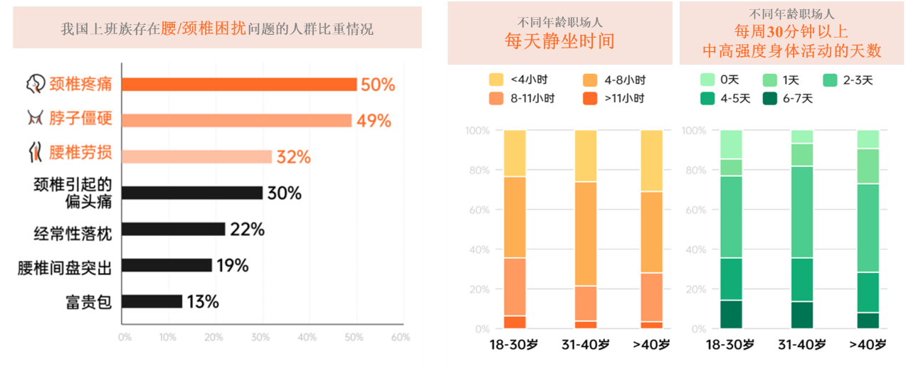

图4-1 腰椎疾病负担数据

4.1.2 健康意识提升与预防性需求激增

传统观念中，患者多在症状加重后才就医，但近年来公众逐渐认识到“防大于治”。在消费市场，一场关于“护腰”的革命正在悄然兴起。图4-2显示，随着年轻人对于腰部健康的关注度不断上升，护腰相关产品的销量和销售额也在不断上涨，平均单月销售额高达上亿。随着人们对健康意识的提高和医疗技术的不断进步，对肌肉疲劳监测设备的需求将不断增长，如图4-3所示。同时，响应国家宏观政策发展，如图4-4所示。本项目所设计的柔性肌电图贴片具有独特的技术优势和市场需求，预计能够占据一定的市场份额。

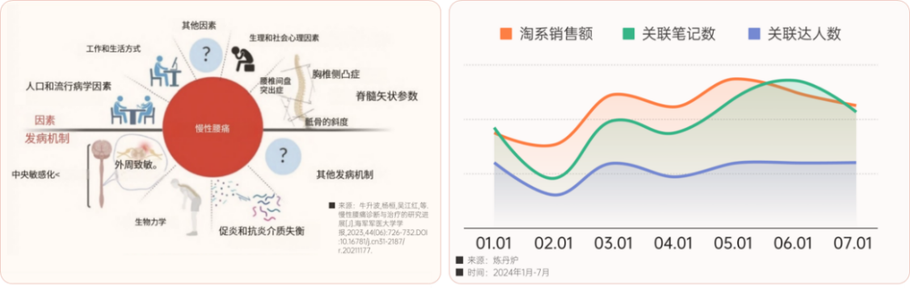

图4-2：“护腰概念”悄然兴起 护腰市场洞察

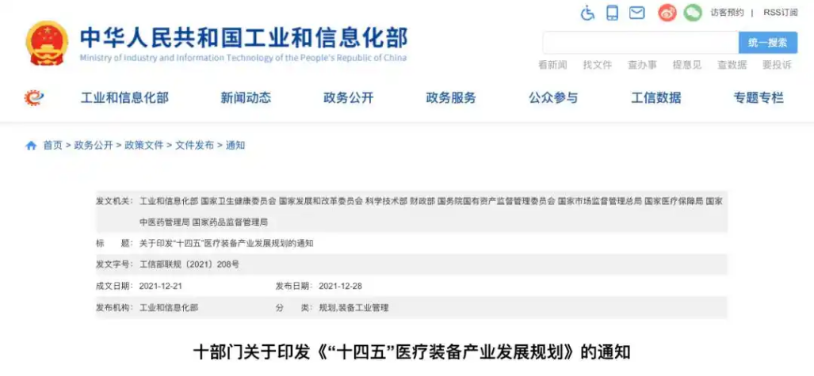

图4-3：中国"十四五"规划明确将智能可穿戴医疗设备列为重点发展领域

4.2 经济与社会效益分析

4.2.1 经济效益分析

1.  降低医疗成本

（1）早期诊断减少治疗费用：通过FEP贴片实时监测肌肉疲劳，能够及早发现腰椎疾病的迹象，从而避免病情恶化导致的更高昂的治疗费用。

（2）提高医疗资源利用效率：项目的实施有助于减少因腰椎疾病导致的医疗资源占用，使医疗资源能够更合理地分配给其他需要的患者。

2.  创造新的经济增长点

（1）健康科技产业发展：FEP贴片作为健康科技领域的一项创新产品，进行有效市场定位，如图4-5所示，以及营销策略，如图4-6
所示。其研发和生产将带动相关产业链的发展，包括材料科学、电子工程、生物医学等多个领域。

（2）就业与创业机会：随着FEP贴片市场的扩大，将创造更多的就业机会和创业机会，促进经济社会的全面发展。随着技术的不断成熟和成本的降低，本项目的贴片有望在更广泛的领域得到应用，如智能家居、可穿戴设备、智能安防等。可进行License+SaaS混合收费，如图4-7所示。同时，了解和学习应对风险对冲策略，如图4-8所示。这将进一步推动市场规模的增长，为项目带来更大的经济效益。

图：商业模式

图：营销模式

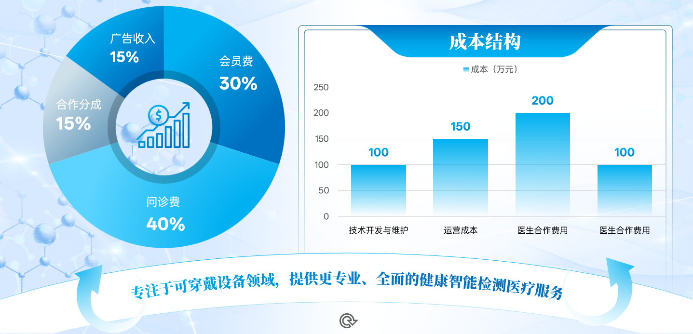

图：盈利模式

4.2.2 社会效益分析

1.  提升公众健康水平

（1）预防腰椎疾病：项目开发的柔性肌电图贴片（FEP）能够长期稳定地监测肌肉疲劳，特别是在长期坐姿下。这有助于及时发现肌肉疲劳状态，从而提醒用户调整坐姿、进行适当休息或锻炼，有效预防腰椎疾病的发生。

（2）提高生活质量：腰椎疾病常导致疼痛、活动受限等问题，严重影响患者的生活质量。项目的实施和宣传将提高公众对腰椎健康问题的认识和重视程度，促使更多人关注并采取措施保护自己的腰椎健康。通过本项目的实施，能够减少腰椎疾病的发生，从而间接提升公众的整体生活质量。

2.  促进医疗技术创新

（1）推动肌电图技术发展：FEP贴片采用低模量网状电极和原位凝胶水凝胶界面，提高了肌电信号的采集稳定性和舒适度，为肌电图技术的发展提供了新的思路和方法。FEP贴片作为一种创新的健康监测设备，其成功应用将推动健康科技的普及和发展，为更多人提供便捷、高效的健康监测手段。

（2）促进跨学科合作：项目联合多个单位，促进了体育科学、纳米技术、电气工程和医学等多个领域的交叉融合，推动了医疗技术的创新。

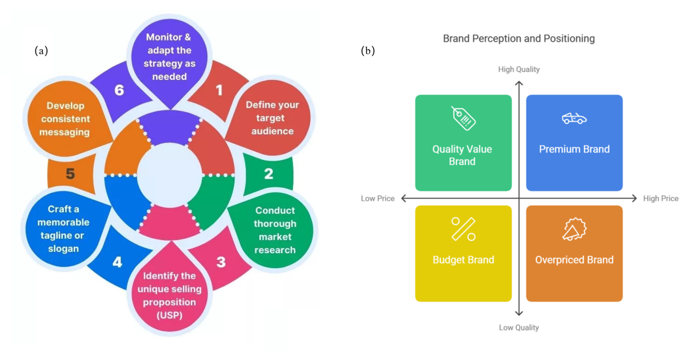

图 4-5：(a) 产品定位 (b) 使用感知图了解市场动态

4.3 展望

肌电图通过分析其波形、时程、波幅等数据，判断神经肌肉系统是处于正常的生理状态还是病理状态，能够辅助诊断及鉴别诊断神经源性损害、肌源性损害和神经肌肉接头病变，发现亚临床病灶或容易被忽略的病灶，如早期运动神经元病、深部肌肉萎缩、肥胖儿童的肌肉萎缩等，同时辅助对神经肌肉疾病的疗效观察及预后检测。目前，肌电图检查过程中会将同心针电极插入肌肉，属于有创操作，会给身体造成一定的痛苦。通常分四个步骤进行观察：针电极插入肌纤维瞬间的电活动；针电极插入后，肌肉松弛时自发性电活动；轻度用力收缩时运动单位电位的特征；最大用力收缩时运动单位电位募集类型。而在肌电贴片普及之后，可以使EMG电极灵活适应皮肤表面,以确保对其信号的稳定检测。并且创伤将减少,使肌电图的检测逐步从有创操作至无创操作。

其二，进一步加强国内外科研机构与高校之间的联系与合作,使产品迭代速度上升。在未来,肌电图的检测不再是一个繁琐的检测。将肌电图的检测的门槛大大降低，使人们可以居家就进行肌电图的测量，从而预防腰椎病等疾病的产生。

参考文献

\[1\] Christensen, S. W. M., Palsson, T. S., Krebs, H. J.,
Graven-Nielsen, T. & Hirata, R. P. Prolonged slumped sitting causes neck
pain and increased variocoupler muscle activity during a computer task
in healthy participants-a randomized crossover study. *Appl. Ergon.*
110, 104020 (2023).

\[2\] De Carvalho, D. E. et al. Association of exposures to seated
postures with immediate increases in back pain: a systematic review of
studies with objectively measured sitting time. *J. Manipulative.
Physiol. Ther.* 43, 1-12 (2020).

\[3\] Boukabache, A., Preece, S. J. & Brookes, N. Prolonged sitting and
physical inactivity are associated with limited hip extension: a
cross-sectional study. *Musculoskelet. Sci. Pract.* 51, e102282 (2021)

\[4\] Lis, A. M., Black, K. M., Korn, H. & Nordin, M. Association
between sitting and occupational LBP. *Eur. Spine. J.* 16, 283-298
(2007).

\[5\] Park, J. H. & Srinivasan, D. The effects of prolonged sitting,
standing, and an alternating sit-stand pattern on trunk mechanical
stiffness, trunk muscle activation and low back discomfort. *Ergonomics*
64, 983-994 (2021).

\[6\] Sasiadek, M. & Jackow-Nowicka, J. Degenerative disease of the
spine: how to relate clinical symptoms to radiological findings. *Adv.
Clin. Exp. Med.* 33, 91-98 (2024).

\[7\] Deer, T. et al. A review of lumbar spinal stenosis with
intermittent neurogenic claudication: disease and diagnosis. *Pain Med.*
20, S32-S44 (2019).

\[8\] Szpalski, M. & Gunzburg, R. Lumbar spinal stenosis in the elderly:
an overview. *Eur. Spine. J. *12, S170-S175 (2003).

\[9\] Wei, B. & Wu, H. Study of the distribution of lumbar modic changes
in patients with low back pain and correlation with lumbar degeneration
diseases. *J. Pain. Res.* 16, 3725-3733 (2023).

\[10\] Chen, C. et al. Prevalence of low back pain in professional
drivers: a meta-analysis. *Public Health* 231, 23-30 (2024).

\[11\] Ferreira, M. L. et al. Global, regional, and national burden of
low back pain, 1990-2020, its attributable risk factors, and projections
to 2050: a systematic analysis of the global burden of disease study
2021. *Lancet Rheumatol* 5, e316-e329 (2023).

\[12\] Eldabe, S. et al. Network meta-analysis and economic evaluation
of neurostimulation interventions for chronic nonsurgical refractory
back pain. *Clin. J. Pain* 40, 507-517 (2024).

\[13\] Channak, S., Spekle, E. M., van der Beek, A. J. & Janwantanakul,
P. The effectiveness of a dynamic seat cushion in preventing neck and
low-back pain among high-risk office workers: a 6-month
cluster-randomized controlled trial. *Scand. J. Work Environ. Health*
50, 555-566 (2024).

\[14\] Merlo, J. K. et al. Effects of a mat pilates exercise program
associated with photobiomodulation therapy in patients with chronic
nonspecific low back pain: a randomized, double-blind, sham-controlled
trial. *Healthcare (Basel)* 12, 1416 (2024).

\[15\] Hoffeld, K. et al. Patient-related risk factors and lifestyle
factors for lumbar degenerative disc disease: a systematic review.
*Neurochirurgie* 69, 101482 (2023).

\[16\] Wu, A. et al. Global low back pain prevalence and years lived
with disability from 1990 to 2017: estimates from the global burden of
disease study 2017. *Ann. Transl. Med.* 8, 299 (2020).

\[17\] Kao, Y. C., Chen, J. Y., Chen, H. H., Liao, K. W. & Huang, S. S.
The association between depression and chronic lower back pain from disc
degeneration and herniation of the lumbar spine. *Int. J. Psychiatry
Med.* 57, 165-177 (2022).

\[18\] Wan, Z. Y. et al. Epidemiology of lumbar degenerative phenotypes
of children and adolescents: a large-Scale imaging study. *Global Spine.
J.* 13, 599-608 (2023).

\[19\] Liu, C. et al. Myelin sheath-inspired hydrogel electrode for
artificial skin and physiological monitoring. *ACS Nano* 18, 27420-27432
(2024).

\[20\] Li, T. et al. Robust skin-integrated conductive biogel for
high-fidelity detection under mechanical stress. *Nat. Commun.* 16, 88
(2025)

\[21\] Raez, M. B., Hussain, M. S. & Mohd-Yasin, F. Techniques of EMG
signal analysis: detection, processing, classification and applications.
*Biol. Proced. Online* 8, 11-35 (2006).

\[22\] Li, X., Wang, Z. L. & Wei, D. Scavenging energy and information
through dynamically regulating the electrical double layer. *Adv. Funct.
Mater*. 34, 2405520 (2024)

\[23\] Wu, J. Understanding the electric double-layer structure,
capacitance, and charging dynamics. *Chem. Rev.* 122, 10821-10859
(2022).

\[24\] Wang, H. et al. High-performance hydrogel sensors enabled
multimodal and accurate human-machine interaction system for active
rehabilitation. *Adv. Mater.* 36, e2309868 (2024).

\[25\] Oh, B. et al. Ultra-soft and highly stretchable tissue-adhesive
hydrogel based multifunctional implantable sensor for monitoring of
overactive bladder. *Biosens. Bioelectron.* 225, 115060 (2023).

\[26\] Li, X. et al. In situ rapid-formation sprayable hydrogels for
challenging tissue injury management. *Adv. Mater.* 36, e2400310 (2024).

\[27\] Coulter, S. M. et al. In situ forming, enzyme-responsive
peptoid-peptide hydrogels: an advanced long-acting injectable drug
delivery system. *J. Am. Chem. Soc.* 146, 21401-21416 (2024).

\[28\] Chen, S. et al. In-situ-sprayed therapeutic hydrogel for
oxygen-actuated Janus regulation of postsurgical tumor
recurrence/metastasis and wound healing. *Nat. Commun.* 15, 814 (2024).

\[29\] Liu, G. W. et al. Drinkable in situ-forming tough hydrogels for
gastrointestinal therapeutics. *Nat. Mater.* 23, 1292-1299 (2024).

\[30\] Li, L. et al. Paintable, fast gelation, highly adhesive hydrogels
for high-fidelity electrophysiological monitoring wirelessly. *Small*,
e2407996 (2024).

\[31\] Yao, B. et al. Ultrastrong, highly conductive and capacitive
hydrogel electrode for electron-ion transduction. *Matter* 5, 4407-4424
(2022).

\[32\] Lan, L. et al. Skin-inspired all-natural bogel for bioadhesive
interface. *Adv. Mater.* 36, e2401151 (2024).

\[33\] Lin, Y., Roos, Y. H. & Miao, S. Pectin and enzyme complex
modified fish scales gelatin: Rheological behavior, gel properties and
nanostructure. *Carbohydr. Polym*. 156, 294-302 (2017).

\[34\] Tian, Z. et al. Hydrogen bonding-mediated phase-transition
gelatin-based bioadhesives to regulate immune microenvironment for
diabetic wound healing. *Bioact. Mater.* 46, 434-447 (2025).

\[35\] Li, Y. et al. Effects of glycation modifications of different
glycosylating agents on the molecular structure and gel properties of
sheep's hoof gelatin. *Food Hydrocoll.* 159, 110598 (2025).

\[36\] Pailler-Mattei, C., Bec, S. & Zahouani, H. In vivo measurements
of the elastic mechanical properties of human skin by indentation tests.
*Med. Eng. Phys.* 30, 599-606 (2008).

\[37\] Zhang, Z. et al. Hydrogel materials for sustainable water
resources harvesting & treatment: synthesis, mechanism and applications.
*Chem. Eng. J.* 439, 135756 (2022).

\[38\] Yang, M., et al. Highly-stable, injectable, conductive hydrogel
for chronic neuromodulation. *Nat. Commun.* 15, 7993 (2024).

\[39\] Yan, S. et al. Mechanically robust, transparent, conductive
hydrogels based on hydrogen bonding, ionic coordination interactions and
electrostatic interactions for light-curing 3D printing. *Chem. Eng. J.*
486, 150289 (2024).

\[40\] Zhang, M. et al. Recent advances in environmentally friendly
dual-crosslinking polymer networks. *Angew. Chem. Int. Ed. Engl.* 63,
e202318035 (2024).

\[41\] Liu, X. et al. Binary multi-frequency signal for accurate and
rapid electrochemical impedance spectroscopy acquisition in lithium-ion
batteries. *Appl. Energy* 364, 123221 (2024).

\[42\] Aniskevich, Y., Yu, J. H., Kim, J. Y., Komaba, S. & Myung, S. T.
Tracking sodium cluster dynamics in hard carbon with a low specific
surface area for sodium-ion batteries. *Adv. Energy Mater.* 14, 2304300
(2024).

\[43\] Li, S. et al. Structural electronic skin for conformal tactile
sensing. *Adv. Sci.* 10, e2304106 (2023).

\[44\] Choi, H. J., Kang, B. C. & Ha, T. J Self-reconfigurable
high-weight-per-volume-gelatin films for all-solution-processed on-skin
electronics with ultra-conformal contact. *Biosens. Bioelectron.* 184,
113231 (2021).

\[45\] Zhang, X. et al. Self-adhesive ILn@MXene multifunctional hydrogel
with excellent dispersibility for human-machine interaction, capacitor,
antibacterial and detecting various physiological electrical signals in
humans and animals. *Nano Energy* 133, 110484 (2025).

\[46\] Yan, C. et al. A wearable sign language translation device
utilizing silicone-hydrogel hybrid triboelectric sensor arrays and
machine learning. *Nano Energy* 133, 110425 (2025).

\[47\] Gonzalez-Izal, M., Malanda, A., Gorostiaga, E. & Izquierdo, M.
Electromyographic models to assess muscle fatigue. *J. Electromyogr.
Kinesiol.* 22, 501-512 (2012).

\[48\] Graham, R. B., Wachowiak, M. P. & Gurd, B. J. The assessment of
muscular effort, fatigue, and physiological adaptation using EMG and
wavelet analysis. *PLoS One* 10, e0135069 (2015).

\[49\] Ament, W., & Verkerke, G. J. Exercise and fatigue. *Sports
medicine* 39, 389-422 (2009).

\[50\] Jia, J. et al. A blink restoration system with contralateral EMG
triggered stimulation and real-time artifact blanking. *IEEE Trans.
Biomed.* 7, 140-148 (2013).

\[51\] Gao, H. et al. Force decoding of caudal forelimb area and rostral
forelimb area in chronic stroke rats. *IEEE Trans. Biomed.* 68,
3078-3086 (2021).

\[52\] Wei, W. et al. Surface-electromyography-based gesture recognition
by multi-view deep learning. *IEEE Trans. Biomed.* 66, 2964-2975 (2019).

\[53\] Duan, S. et al. A hybrid multimodal fusion framework for
sEMG-ACC-based hand gesture recognition. *IEEE Sens. J.* 23, 2773-2784
(2023).

附录

<table>
<thead>
<tr class="header">
<th>附录 1</th>
</tr>
</thead>
<tbody>
<tr class="odd">
<td>介绍: 各附录的内容</td>
</tr>
<tr class="even">
<td>
附录2：产品实物

附录3：数据对比

附录4：论文投递情况

附录5：专利投递情况
</td>
</tr>
</tbody>
</table>

| 附录 2                                                                                                                                 |
| ------------------------------------------------------------------------------------------------------------------------------------ |
| 介绍: 产品实物                                                                                                                             |
| 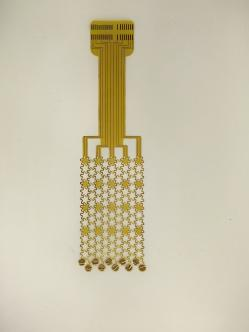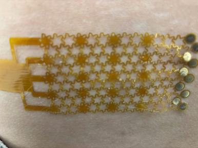 |

| 附录 3                                                               |
| ------------------------------------------------------------------ |
| 介绍: 数据对比                                                           |
| 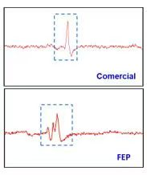 |

| 附录 4                               |
| ---------------------------------- |
| 介绍: 论文投递情况                         |
|  |

| 附录 5                                                                                                   |
| ------------------------------------------------------------------------------------------------------ |
| 介绍: 专利投递情况                                                                                             |
| 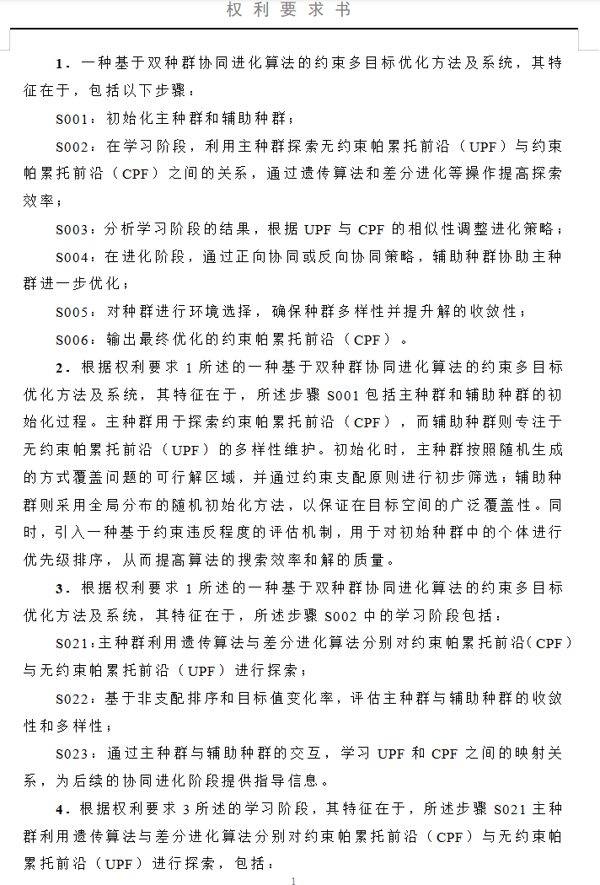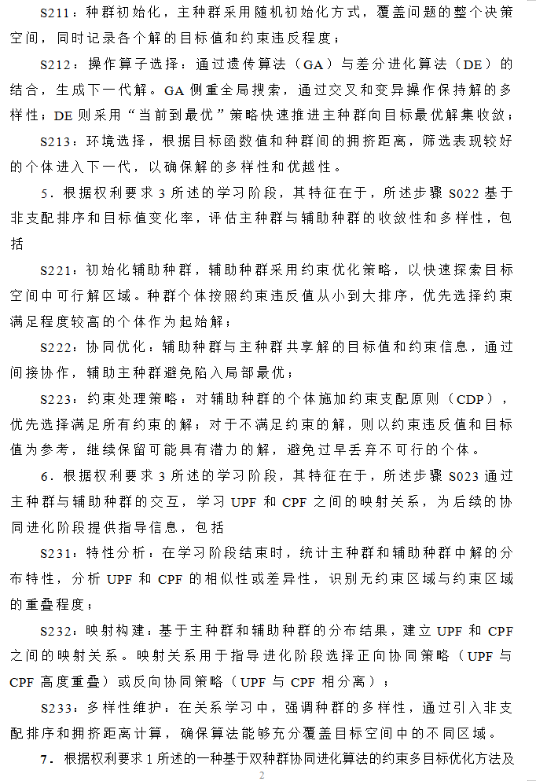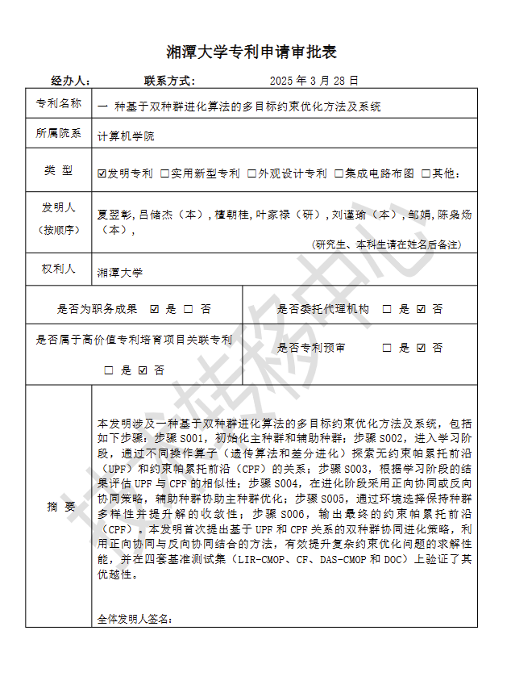 |
